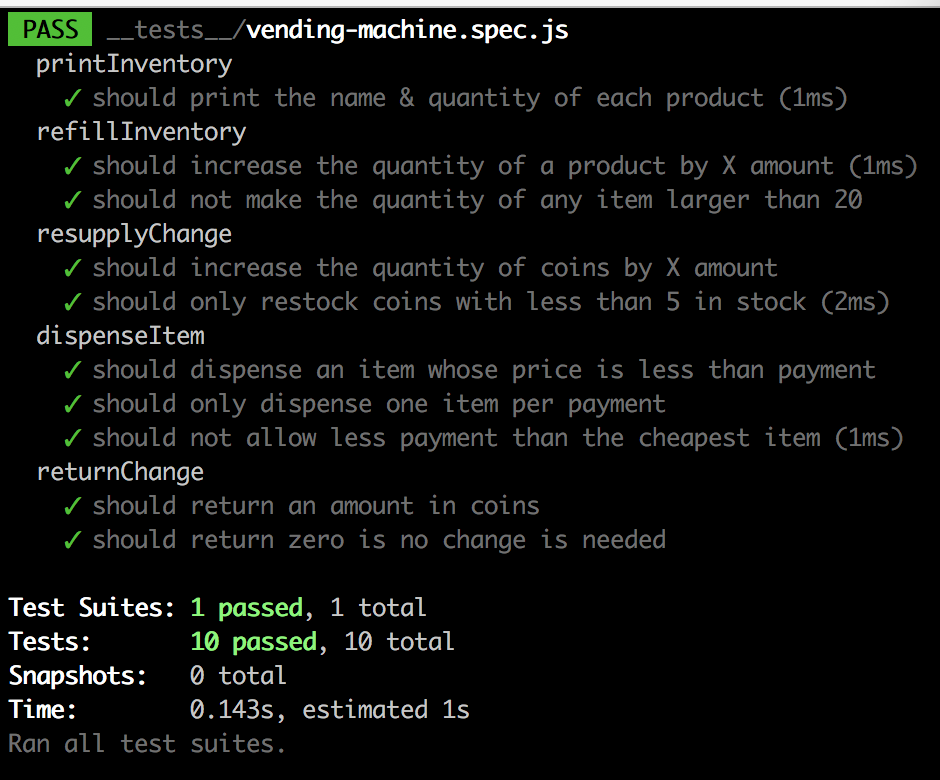

# Project 3 - Coding Interview

This is a JavaScript project to simulate a vending machine! It will print the current inventory, dispense an item based on payment, and return your change in coins!

This project was built using [Jest](https://facebook.github.io/jest/) to help develop a TDD approach to programming!

## Test results:

